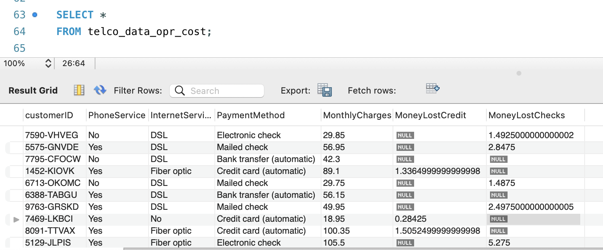

# Telecom Case Study
Looks into a sample Telecom data to minimize operational cost due to high bank fees from credit card/checks 
and increase revenue 

## <ins>Introduction

The `Twitter Command Line Interface (CLI) Application` is capable of posting, showing, and deleting a post on Twitter
using the command line. Libraries such as `HTTP` and `OAuth 1.0` were used to send/receive/authenticate requests using
the Twitter Rest APIs. The Jackson library was used to convert JSON objects to Tweet objects. Moreover, Apache Maven was

__Targeted User:__ This information will be useful for the marketing team in telecom companies

__Technologies:__
>  MySQL | Kaggle 

