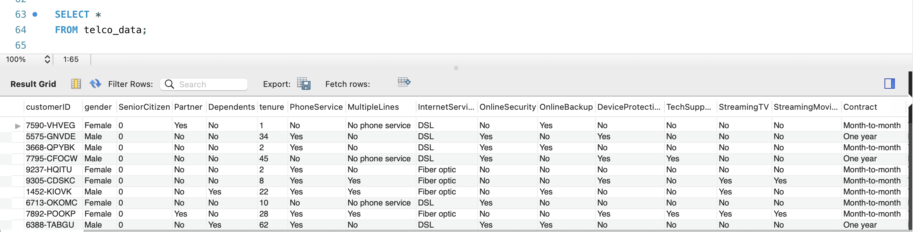
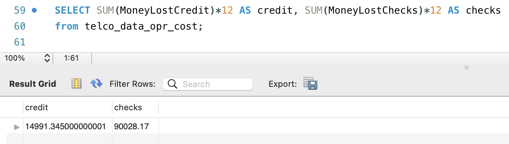

# Telecom Case Study

## <ins>Introduction

The `Telecom Case Study` analyses the impact operational cost has on the profit margin, by looking through a sample Telecom data set obtained from Kaggle. This information can be used by marketing teams
in Telecom companies to understand the need to incentivize customers to pay using
pre-authorized debit instead of credit cards or checks.

__Context:__  As an outcome of a recent lawsuit against MasterCard and Visa, retailers were 
allowed to pass on the bank processing fees on credit card payment on to the customer. 
But since CRTC which governs the pricing in Canadian Telecom industry denied approval to this, 
telecom industry is still facing this bank charge.

__Source:__  
- https://crtc.gc.ca/eng/archive/2022/2022-335.htm

__Targeted User:__ This information will be useful for the marketing team in telecom companies

__Technologies:__
>  SQL | MySQL Workbench | Kaggle 

## <ins> Table Structure - Reducing Operation Cost

#### Original table structure:

#### Calculating operational cost for credit card and checks:

#### Yearly cost for payment by credit card and checks:

## <ins> Analysis

#### Reducing Operational Cost

The company is loosing approximately $105,000 a year, this is for a sample size of 7000 with the 
following assumptions:
   
   - Analyses data 
   - Credit card fee is 1.5%
   - Internal processing fee for checks are 0.5%
   - Only monthly charges are taken into account (regardless of contract)

This number would increase significantly for big companies where the number of active users 
might cross 1 Million. One way to save this money is by providing incentives to have
customers pay by pre-authorized debit.

